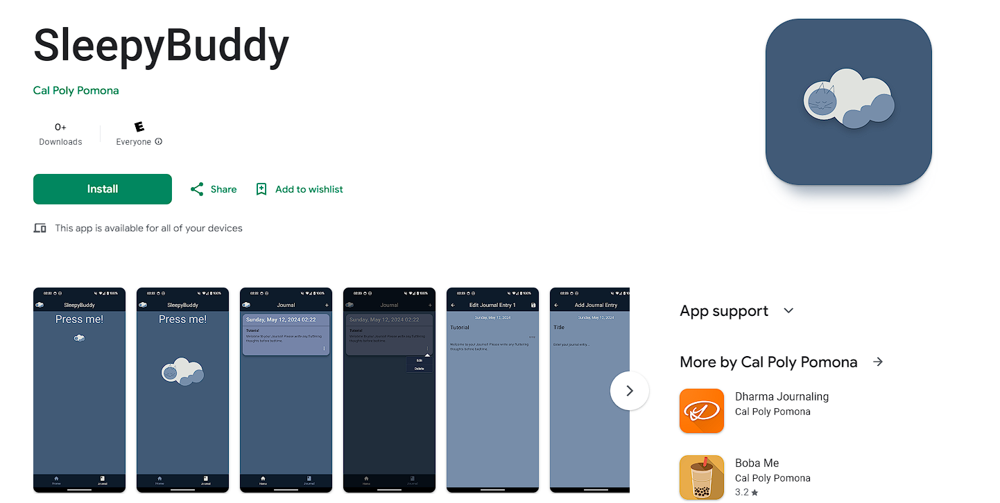

# sleepybuddy

A bedtime journal app made by Gian David Marquez @ CPP.



## Github Branches
* master / goodbye alarm - These branches has the commits while I was working on the project name sleeplist, has commits from the beginning. 

NEW MASTER BRANCH:
* fix-name-dev - This branch has the working functionality from master, just renamed from sleepybuddy to sleeplist. Has the most current features as well, and is what will be published under as.

## App Links
* [Google Play Links](https://play.google.com/store/apps/details?id=edu.cpp.cs4750.giandm.sleepybuddy)
* [Youtube App Demo](https://youtu.be/_PN4l1Rosh8).

## File Structure
```
assets
├── icons
│   ├── play_store_512.png - icon
│   └── background.png - for adaptive, android 12
|
└── images
    ├── logo_buddy_pressable.png
    ├── logo_buddy.png
    └── logo_name_n_buddy.png
       
lib
├── models
│   ├── entry.dart - Isar Collection 
│   ├── entry.g.dart - Isar Generated
│   └── entry_database.dart - CRUD
│
├── views
│   ├── screens
|   |   ├── home_page.dart
|   |   ├── journal_add_page.dart
|   |   ├── journal_edit_page.dart 
|   |   ├── journal_page.dart
|   |   └── splash_screen.dart
|   |
|   ├── theme
|   |   └── colors.dart - The Five colors I used
|   └── widgets
|       ├── buddy_pressable.dart - How The Home Page has a pressable Cat Buddy
|       ├── journal_card.dart - Journal Card Display
|       └── journal_popover_menu.dart - Pop-Up Menu on the Card
|
└── main.dart
```
### Dependencies used
This App was built using many flutter packages
* [is_first_run](https://pub.dev/packages/is_first_run)
* [provider](https://pub.dev/packages/provider)
* [Isar Database](https://pub.dev/packages/isar)
* [intl - DateTimeFormatting](https://pub.dev/packages/intl)
* [popover - Popup Menu](https://pub.dev/packages/popover)
* [Flutter Launcher Icons](https://pub.dev/packages/flutter_launcher_icons)
* [Flutter Splash](https://pub.dev/packages/flutter_native_splash)
